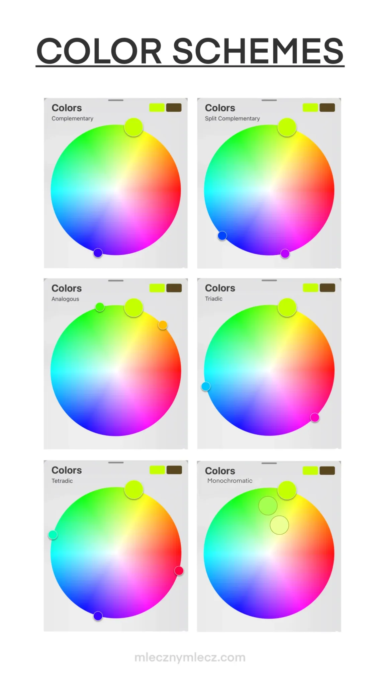

## Enlightened - DMX lighting from MIDI notes

Firmware for a microcontroller that converts MIDI notes into amazing DMX lights with little setup required.

### How it works

#### Notes

Right now, the code is configured to work with 6 fixtures, but can theoretically be expanded to as many as you want. These can be triggered symmetrically or individually.

The color (hue) depends on the velocity of each note. 127 will use the existing color scheme (see below), and 0-126 will select a specific hue.

- C3: Fixture 1 and 6
- D3: Fixture 2 and 5
- E3: Fixture 3 and 4
- F3: Fixture 1
- F#3: Fixture 2
- G3: Fixture 3
- G#3: Fixture 4
- A3: Fixture 5
- A#3: Fixture 6

#### Color Schemas

The _type_ of scheme depends on which note is triggered (see below), and the _base hue_ depends on the velocity (0-127 = 0-360).

- E2: Static (same color for all fixtures)
- F2: Complementary
- G2: Analogous
- A2: Triadic
- B2: Split Complementary

### Thanks

- [TeensyDMX.h](https://github.com/ssilverman/TeensyDMX) - the library I used to send DMX signals
- [Paul Stoffregen](https://github.com/PaulStoffregen) for inventing the Teensy microcontroller and developing many of the libraries
- [Jesse Mejia](https://github.com/jmej) for instructing the Microcontrollers and Creative Coding classes at Portland Community College
